```{r, echo=FALSE}
library(rmarkdown)
library(shiny)
library(knitr)
library(learnr)
```

## __Introduction__

Many software solutions have been developed for citation management. You may have heard of one of the most popular commercial solutions, EndNote.

__Zotero__ is a free and open source alternative which can be installed without administrator privileges.

### __Why Do I Need a Reference Manager?__

__Zotero__ offers a number of advantages:
 
1. Zotero acts as a convenient way to store and organize PDFs of your papers
2. Zotero makes it easy to automatically cite papers in a manuscript in Microsoft Word or Open Office using the appropriate format for your selected journal
3. Zotero makes it easy to automatically create a bibliography at the end of your manuscript
4. Zotero can download papers and automatically store the information about the citation from PubMed or journal websites
4. Zotero makes it easy to share papers with others

```{r whyzotero, echo=FALSE}
question("Which of the following is NOT a potential benefit of Zotero discussed above?",
         answer("Zotero is free to download and use."),
         answer("Zotero is open source, meaning it can be improved and extended by people around the world.", message = "That's a _ratio_ variable."),
         answer("Zotero allows you to automatically generate citations and bibliographies."),
         answer("You are entitled to real-time technical support.", correct = TRUE),
         answer("Zotero organizes your papers and allows you to share them with others."),
     correct = "Correct.",
     incorrect = "Sorry, try again.",
     random_answer_order = TRUE,
     allow_retry = TRUE
)
```

## __Installing Zotero__
__Zotero__ comes in two main parts:

1. The main reference manager program, `Zotero`
2. The browser plugin, `Zotero Connector`, used to easily import new papers

Install the main reference manager program by visiting [the download page](https://www.zotero.org/download/).

On that same page, you will likely find a link to __Zotero Connector__ that matches your browser. 

```{r echo=FALSE, out.width = '90%'}
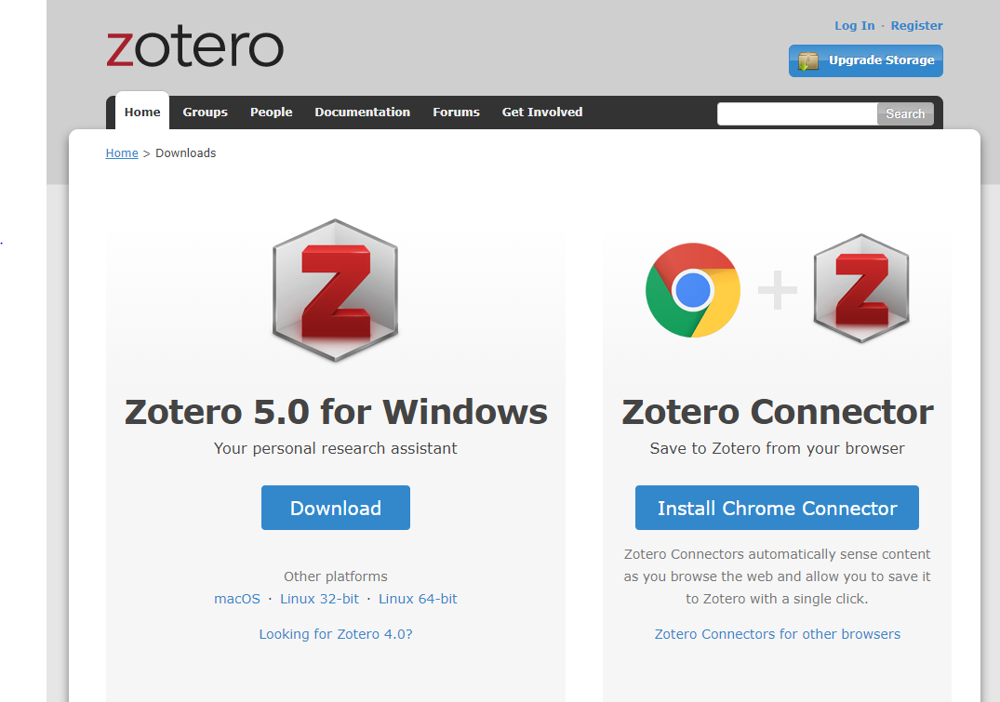
```

You may receive a warning that installation cannot continue due to lack of permissions, but it may successfully install anyway. 

```{r echo=FALSE}
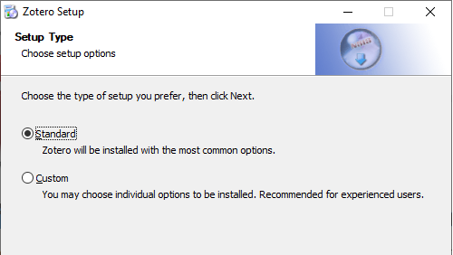
```

Once __Zotero__ is installed, you can also install __Zotero Connector__. 

```{r echo=FALSE}

```

## __Importing a Zotero Library__
Now that __Zotero__ has been installed, your organization may have a common library of publications to get you started. 

```{r echo=FALSE}
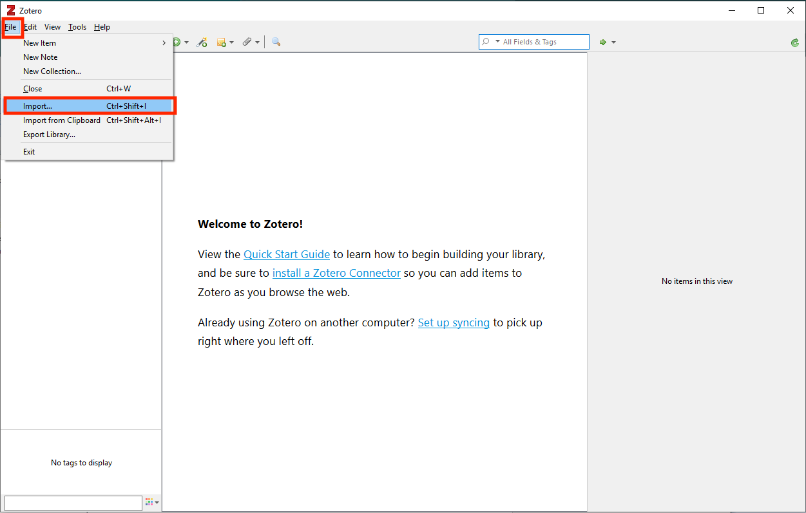
```

Click on `File` and Select `Import`. Follow the dialog boxes until you are directed to select a file. 

```{r echo=FALSE}
knitr::include_graphics("www/Fig7.png")
```

Navigate to your organization's `.rdf` file and choose `Open`. 

```{r echo=FALSE}
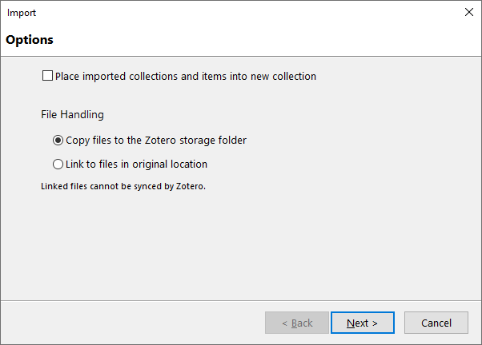
```

If your organization's library contains `.pdf` files, you will be asked if you would like to move the files to the Zotero library folder. I recommend that you allow Zotero to manage file locations. 

```{r echo=FALSE}
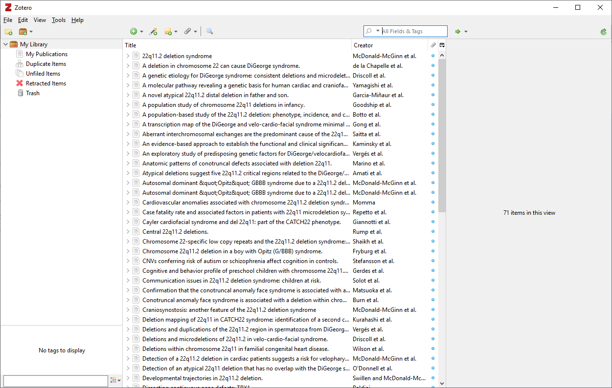
```

Once the importation process is complete, you will see the papers in your Zotero library.

## __Inserting Citations in Microsoft Word__

Once __Zotero__ is installed, you will find a `Zotero` section of the Microsoft Word ribbon.

```{r echo=FALSE, out.width="90%"}
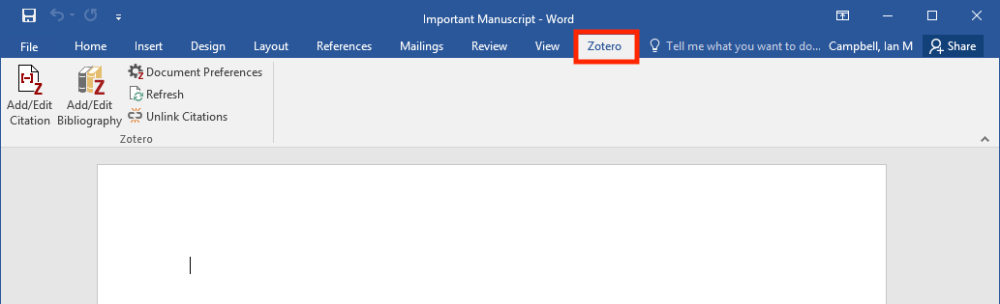
```

### __Selecting a Citation Style in Zotero__

Before you get started, you must select a format for your citations and bibliography. Click `Document Preferences` to get started.

```{r echo=FALSE, out.width="90%"}
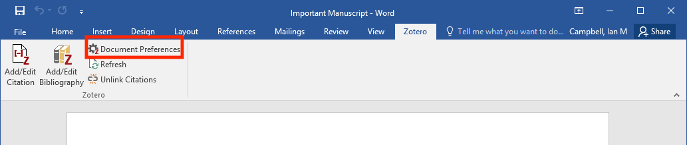
```

Only the most common formats, such as American Medical Association and Chicago Manual of Style are installed by default.

```{r echo=FALSE, out.width="50%"}
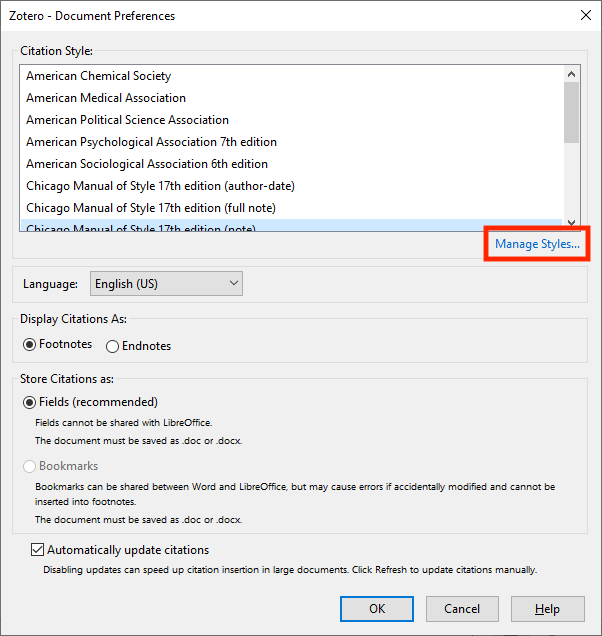
```

There are many hundreds more to choose from online. Click `Manage Styles...` to add more.

```{r echo=FALSE, out.width="50%"}
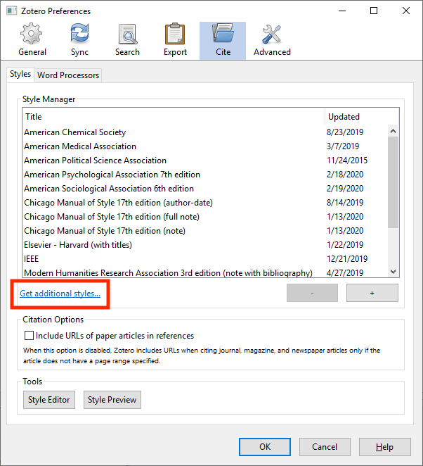
```

The citation tab of options will open. Click `Get additional styles...` to search for more.

```{r echo=FALSE, out.width="80%"}
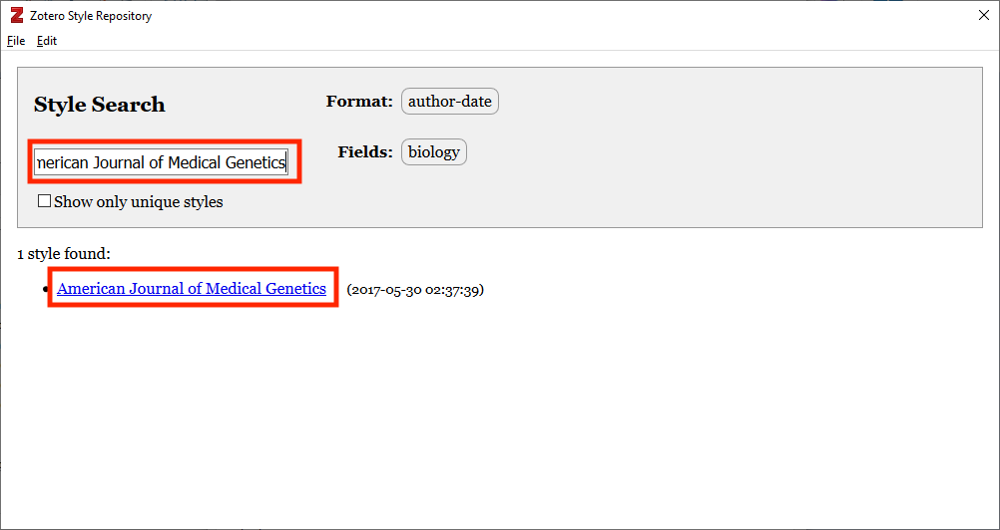
```

Type the name of the journal in the search box. The results will automatically appear. Take care with spelling as partial searches are not supported. Search for the entire journal name. 

Once you have found the appropriate journal, click on the link to add it to your available styles.

```{r echo=FALSE, out.width="50%"}
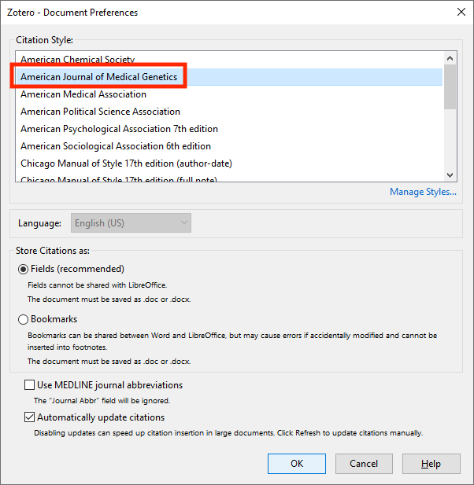
```

Return to Microsoft Word and press the `Document Preferences` button again if necessary. Select your journal in the list and select `OK`. 

__Note that the style can be changed at any time using the same procedure.__

### __Inserting a Citation in Microsoft Word__

```{r echo=FALSE, out.width="90%"}
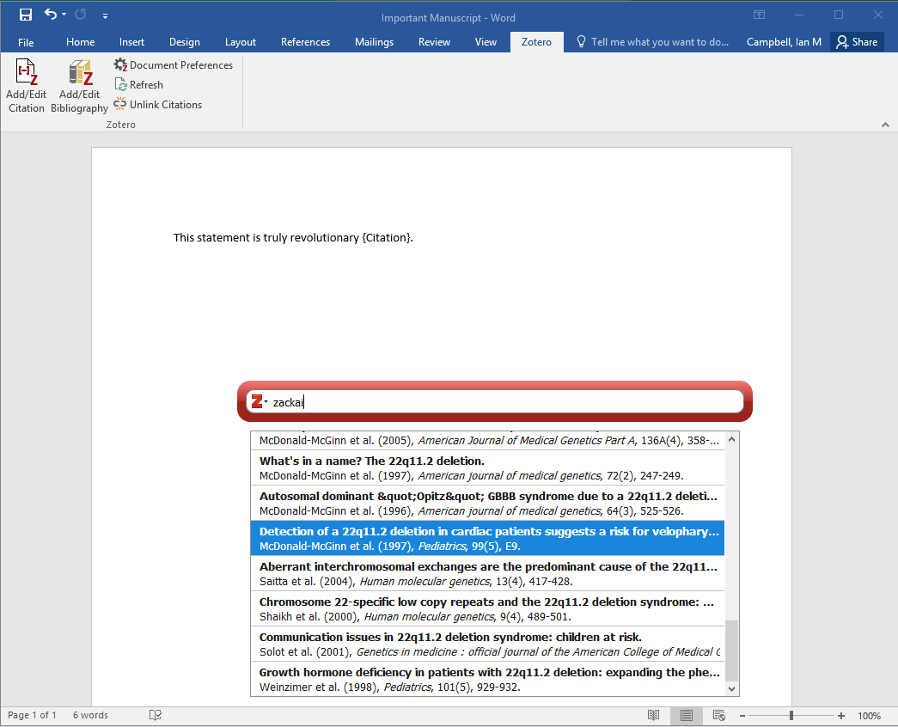
```

When you're ready to insert a citation, place the cursor in the document where you want the citation to appear. Then press the `Add/Edit Citation` button.

A search box will appear where you can begin searching for the paper you wish to cite. You can search for and metadata element including author, title, journal, and year. 

```{r echo=FALSE, out.width="90%"}
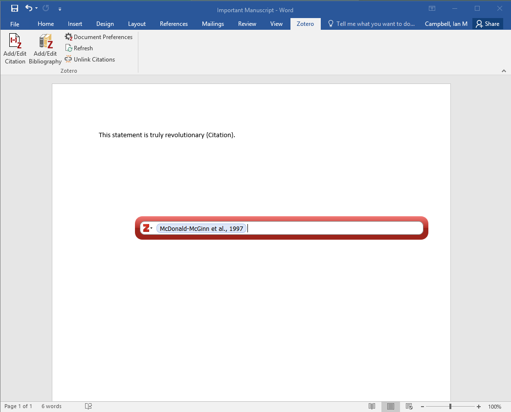
```

Once you have identified the paper, press `Enter`. A token will be created in the search box to indicate that the paper has been selected. You can now search for additional papers to create multi-paper citations. 

Once you have added all of the papers you want, press `Enter` again. The citation will be inserted into the paper in the appropriate format.

```{r echo=FALSE, out.width="90%"}

```

Whenever new citations are added, all other citations in the document are automatically reformatted to have the appropriate order. 

## __Inserting a Bibliography in Microsoft Word__

```{r echo=FALSE, out.width="90%"}
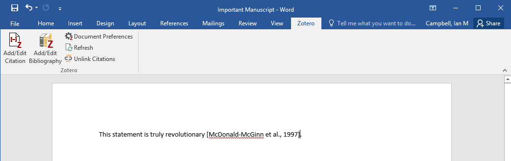
```

Once you have added at least one citation, place your cursor where you wish the bibliography to appear. Then simply press the `Add/Edit Bibliography` button. The bibliography is added with the appropriate format for the journal. 

As new citations are added to the manuscript, the bibliography is automatically updated. 

```{r beforeciting, echo=FALSE}
question("Before you can insert a citation in a document, you MUST do which of the following?",
         answer("Determine the appropriate font size of the citation."),
         answer("Calculate the total number of references to be placed in the document."),
         answer("Select a citation style to be used in the document.", correct = TRUE),
         answer("Determine the order of the citations."),
     correct = "Correct.",
     incorrect = "Sorry, try again.",
     random_answer_order = TRUE,
     allow_retry = TRUE
)
```