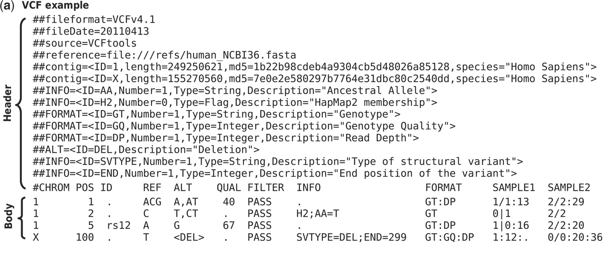

```{r, echo=FALSE}
library(rmarkdown)
library(shiny)
library(knitr)
```

# Introduction

In genetics, __variants__ are differences in the gentic code that vary from the reference sequencing. The reference is arbitrarily defined by the [Genome Reference Consortium](https://www.ncbi.nlm.nih.gov/grc) and ideally represents the most common genetic sequence across humanity. Although many sequences in the reference deviate from this ideal^[1](https://www.ncbi.nlm.nih.gov/pmc/articles/pmid/26670213/)^, such issues are outside of the scope of this tutorial. 

Bioinformatically, variants are typically represented in one of two ways.

1. Variant call files (vcf)
2. Flat text files

## Variant Call Format
__Variant call format__ files are standarized, uncompressed text files used to store variants. Although they are wasteful from a space perspective, they are the _de facto_ standard. There are compression strategies discussed later.

The following figure is from the [Danecek _et al_ paper in _Bioinformatics_](https://www.ncbi.nlm.nih.gov/pmc/articles/pmid/21653522/) that defines the standard.

```{r echo=FALSE, out.width = '90%'}

```

The begining of every VCF file is a header that defines the file format and ideally the version of the reference genome used to call the variants initially. 

The final line of the header defines subsequent fields in the body.

### VCF Field Description
Here is a description of all of the fields in a VCF file.
```{r echo = FALSE, results='asis'}
ToRender <- rbind(c("1","CHROM","Chromosome of the variant"),
                  c("2","POS","1-based position of the start of the varirant"),
                  c("3","ID","Unique identifier of the varirant, if any"),
                  c("4","REF","The referenece allele at that position"),
                  c("5","ALT","The alternative allele identified at that position in the subject"),
                  c("6","QUAL","The PHRED quality of the call of the allele"),
                  c("7","FILTER","Site filtering information"),
                  c("8","INFO","Semicolon delimited field that can be customized to the user's neads"),
                  c("9","FORMAT","Colon delimited field that defines the information contained within each subsequent genotype column"),
                  c("10+","Samples","Genotype information for one or multiple samples in the format defined in FORMAT")
                    )
ToRender <- as.data.frame(ToRender)
colnames(ToRender) <- c("Number","Field Name","Description")
kable(ToRender)
```

### Understanding the Gentoype Format
```
GT:AD:DP:GQ:PL  0/1:18,21:39:99:543,0,443
```
**GT** - Genotype<br>
This is the genotype of this sample at this site. For a diploid organism, the GT field indicates the two alleles carried by the sample, encoded by a 0 for the reference allele and 1 for the first alternative allele, 2 for the second alternative allele  (for a multiallelic position), and so on. For a position with only a single alternative allelle. 

* 0/0 - the sample is homozygous reference
* 0/1 - the sample is heterozygous, carrying 1 copy of each of the reference and alternative alleles
* 1/1 - the sample is homozygous alternate

For phased variants, the GT could also be 1/0.

**AD** - Allele Depth <br>
The number of reads that supports each of the reported alleles in the same order as the GT field. 

**DP** - Depth of Coverage<br>
The total number of reads that cover the position. In the ideal situation, DP is the sum of the two AD values. However, DP also includes uninformative reads. 

**GQ** - Genotype Quality<br>
The Genotype Quality represents the Phred-scaled confidence that the genotype assignment (GT) is correct. This value expresses how much more likley the called genotype (GT) is than the other possibilities. Often, the value of GQ is capped at 99 because larger values are not more informative, but they take more space in the file.

**PL** - "Normalized" Phred-scaled Likelihoods <br>
For the typical case of a site with a single alternative allele in a diploid organism, the PL field will contain three numbers, corresponding to the three possible genotypes (0/0, 0/1, and 1/1). The PL values are "normalized" so that the PL of the most likely genotype (assigned in the GT field) is 0 in the Phred scale. For each of the alternative calls, the PL expresses how much less likely that genotype is compared to the best one.

## Binary Variant Call Format - VCF Compression
The __<u>b</u>inary variant <u>c</u>all <u>f</u>ormat__ (BCF) is a compressed version of a VCF file. It is compressed into a series of relatively small (~64kB) 'BGZF' blocks. This allows the file to be indexed such that only potions of the file can be retreived and decompressed quickly. BCF files have the `.vcf.gz` file extension.

The `bgzip` program from SAMtools compresses and decompresses `.vcf` and `.vcf.gz` files. By default, if a file name is provided, the `.vcf` file is compressed and deleted, Use the `-c` option to write to standard out. 

```{r, engine = 'bash', eval = FALSE}
module load SAMtools/
bgzip Sample1.vcf
```

```{r echo = FALSE, results='asis'}
ToRender <- rbind(c("-c","Standard out","Write to standard out"),
                  c("-d","Decompress","Decompress a .vcf.gz file"),
                  c("--threads N","Threads","Use N threads for compression (faster)"))
ToRender <- as.data.frame(ToRender)
colnames(ToRender) <- c("Option","Name","Description")
kable(ToRender)
```

The `-d` option is used to decompress files. Due to backwards compatibility, `.vcf.gz` files may also be decompressed with `gunzip`.

```{r, engine = 'bash', eval = FALSE}
module load SAMtools/
bgzip -dc Sample1.vcf.gz > Sample1.vcf
```

## BCF Indexing
Some tools for working with `.vcf.gz` files require a pre-computed index. You can use the `tabix` program to compute an index which is stored in a seperate `.vcf.gz.tbi` file. The `-p vcf` option to define the input as a VCF file. See the [manual](http://www.htslib.org/doc/tabix.html) for full details.

```{r, engine = 'bash', eval = FALSE}
module load sam-bcf-tools/
tabix -p vcf Sample1.vcf.gz
```

## Manipulating BCF Files with bcftools
The `bcftools` program can be used to manipulate `.vcf.gz` files. 

### Merging BCF Files into Multisample BCF Files
Initially, variants are often called ndependently on seperate samples. It can often be helpful to merge these samples into a single file to be analyzed together. Use the `bcftools merge` command to combine files from seperate samples. The samples receive their name from the filename. For speed, the files should have been previously indexed with `tabix` (see above). See the [manual section](http://samtools.github.io/bcftools/bcftools.html#merge) for more details. 

```{r, engine = 'bash', eval = FALSE}
module load sam-bcf-tools/
bcftools merge Sample1.vcf.gz Sample2.vcf.gz Sample3.vcf.gz -Ob -o AllSample.vcf.gz
```

```{r echo = FALSE, results='asis'}
ToRender <- rbind(c("-Ob","Output","Defines the output format. Ob for BCF, Ov for VCF"),
                  c("-o","Output file","Define the output file location. Otherwise outputs to standard out"),
                  c("--use-header Sample1.vcf.gz","Header","Use the header contained in the specified file."))
ToRender <- as.data.frame(ToRender)
colnames(ToRender) <- c("Option","Name","Description")
kable(ToRender)
```

### Extractomg Samples from a Multisample BCF File
Use `bcftools view` to extract one or more samples. Use the `-s` option to name a comma seperated list of samples in the command or the `-S` option to provide a sample file. The list can be prefixed with `^` to exclude those samples. See the [manual section](https://samtools.github.io/bcftools/bcftools.html#view) for full details.

```{r, engine = 'bash', eval = FALSE}
module load sam-bcf-tools/
bcftools view -s Sample1,Sample2 AllSample.vcf.gz -Ob -o Samples1-2.vcf.gz
```

### Converting BCF Files into Other Formats
Use the `bcftools query` command to output desired fields in a specific format. Use the `-f` option to define the format. See the [manual section](http://samtools.github.io/bcftools/bcftools.html#query) for full details. 
```{r echo = FALSE, results='asis'}
ToRender <- rbind(c("%CHROM","The CHROM column (similarly also other columns: POS, ID, REF, ALT, QUAL, FILTER)"),
c("%END","End position of the REF allele"),
c("%END0","End position of the REF allele in 0-based coordinates"),
c("%FIRST_ALT","Alias for %ALT{0}"),
c("%FORMAT","Prints all FORMAT fields or a subset of samples with -s or -S"),
c("%GT","Genotype (e.g. 0/1)"),
c("%INFO","Prints the whole INFO column"),
c("%INFO/TAG","Any tag in the INFO column"),
c("%IUPACGT","Genotype translated to IUPAC ambiguity codes (e.g. M instead of C/A)"),
c("%LINE","Prints the whole line"),
c("%MASK","Indicates presence of the site in other files (with multiple files)"),
c("%POS0","POS in 0-based coordinates"),
c("%PBINOM(TAG)","Calculate phred-scaled binomial probability, the allele index is determined from GT"),
c("%SAMPLE","Sample name"),
c("%TAG{INT}","Curly brackets to print a subfield (e.g. INFO/TAG{1}, the indexes are 0-based)"),
c("%TBCSQ","Translated FORMAT/BCSQ. See the csq command above for explanation and examples."),
c("%TGT","Translated genotype (e.g. C/A)"),
c("%TYPE","Variant type (REF, SNP, MNP, INDEL, BND, OTHER)"),
c("[]","Format fields must be enclosed in brackets to loop over all samples"),
c("\\\\n","new line"),
c("\\\\t","tab character"))
ToRender <- as.data.frame(ToRender)
colnames(ToRender) <- c("Variable","Description")
kable(ToRender)
```

Use this example to print chromosome, position, reference allele, alternate alleles, sample name, and genotype. 

```{r, engine = 'bash', eval = FALSE}
module load sam-bcf-tools/
bcftools query -f '%CHROM\t%POS\t%REF\t%ALT[\t%SAMPLE=%GT]\n' AllSample.vcf.gz -o Genotype.txt
```
