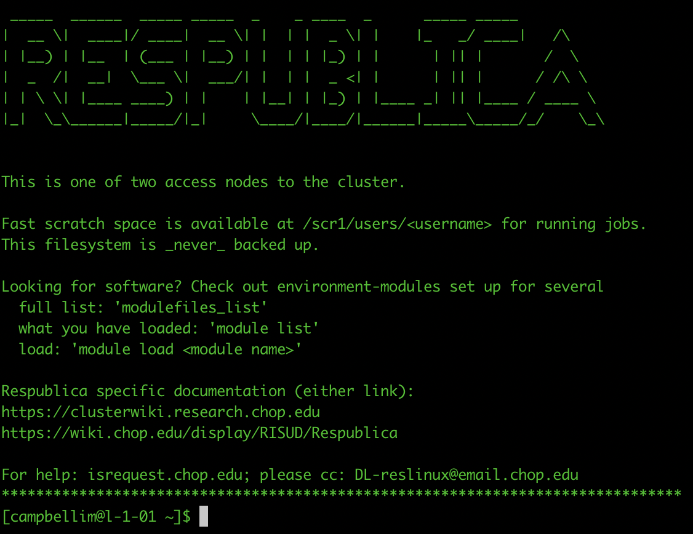
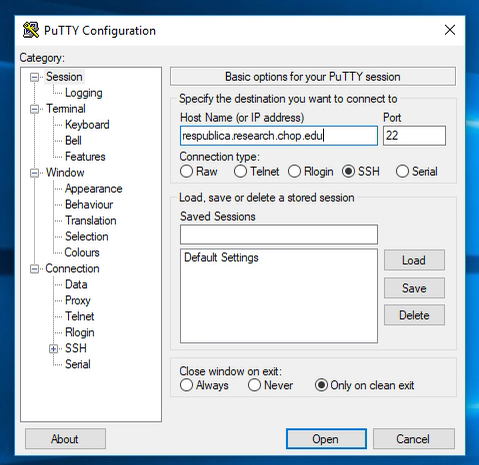

```{r, echo=FALSE}
library(rmarkdown)
library(shiny)
library(knitr)
```
# Introduction

The high performance computing environment at CHOP is named Respublica. The Univa Grid Engine is the implementation of Grid used by CHOP to schedule and submit jobs to the Respublica cluster.

Users log into one of two access nodes to submit jobs to the cluster. 

You must request access to the system via the [Cirrus Support Page](http://cirrus.research.chop.edu/).

## Logging into Respublica

Once you have secured access, connect to the access nodes via secure shell.

### MacOS or Linux
Open terminal and execute the following command:
```{r, engine = 'bash', eval = FALSE}
ssh username@respublica.research.chop.edu
```
Replace `username` with your CHOP user account name.

```{r echo=FALSE, out.width = '50%'}

```

### Windows
You'll need a Windows terminal emulator in order to login to the cluster.

Download and install [Putty](https://www.putty.org/)

```{r echo=FALSE, out.width = '50%'}

```

## Understanding Nodes
When you submit a job, it is sent to a compute node by the Grid system. The compute node is not necessarily the same as the environment on the access node. 

The following filesystem directories are available to all compute nodes. 

```{r, engine = 'bash', eval = FALSE}
/home/*
/mnt/isilon/*
/scr1/*
/cm/shared/*
```

All of the compute nodes have the same operating system installed. Thus, any software you've compiled into your home directory can be run by any node.

If you've loaded software modules on the access node to test your script, you will need to also load that module on each compute node.

Remember, you can see a list of modules available with the following command:
```{r, engine = 'bash', eval = FALSE}
module available
```

Load a module, such as SAMtools, with the following command:
```{r, engine = 'bash', eval = FALSE}
module load SAMtools/
```

# Submitting Jobs
In broad terms, you can submit jobs in one of two ways.

1. Submit a job from a shell script stored in a file read by `qsub`
2. Submit a job by directing the command to `qsub` though standard input (stdin)


## Shell script
The first way is to save a text file with the script you want to run. For example, you could save the following code as `script.sh`:
```{r, engine = 'bash', eval = FALSE}
#!/bin/bash
#$ -pe smp 2
#$ -l h_vmem=4G
#$ -l m_mem_free=4G
#$ -V
module load sam-bcf-tools/
invcf=/mnt/isilon/22qcenter/Exome.vcf
outfile=/mnt/isilon/22qcenter/Exome.vcf.gz
bgzip -c $invcf > $outfile
```

The first line, `#!/bin/bash`, instructs the host to interpret the script with the bash shell. Lines that start with `#$` allow options to be set. Here are some helpfull options. 

### Helpful Options
```{r echo = FALSE, results='asis'}
ToRender <- rbind(c("-S /bin/bash","Shell","Specify the interpreting shell for the script"),
                  c("-pe","Parallel Environment",""),
                  c("-pe smp N","Shared Memory Processing","Request N cores with shared memory resources"),
                  c("-l","Resource",""),
                  c("-l h_vmem=4G","Hard Virtual Memory Limit","Request a hard virtual memory limit of 4 gigabytes per core"),
                  c("-l m_mem_free=4G","Memory Free","Request cores with at least 4 gigabytes of free memory per core"),
                  c("-V","Variables","Exports all environmental variables to the job"),
                  c("-cwd","Current Working Directory","Executes the job from the current working directory"),
                  c("-wd ~","Working Directory","Executes the job from the home directory"),
                  c("-o ~/output.txt","Standard Out","Outputs stdout to ~/output.txt"),
                  c("-e ~/error.txt","Standard Error","Outputs stderr to ~/error.txt"))
ToRender <- as.data.frame(ToRender)
colnames(ToRender) <- c("Option","Name","Description")
kable(ToRender)
```

This script requests 2 cores with 4 gigabytes of memory each for a total of 8 gigabytes. Lines that do not start with special characters are executed in sequence. In this example a module is loaded so that the host can execute the program. We declare two variables and use them to execute the bgzip command. 

To submit the job, execute the following command: 
```{r, engine = 'bash', eval = FALSE}
qsub script.sh
```

## Piping Standard Input
Alternatively, you can pipe a command directly to `qsub` for submission. Here is an example:
```{r, engine = 'bash', eval = FALSE}
echo "module load sam-bcf-tools/; \
bgzip -c /mnt/isilon/22qcenter/Exome.vcf > /mnt/isilon/22qcenter/Exome.vcf" | \
qsub -pe smp 2 -l m_mem_free=4G -l h_vmem=4G
```
This achieves the same result as the `script.sh` above.

## Checking on the Status of Jobs
You can check on the status of jobs using the `qstat` command.
```{r, engine = 'bash', eval = FALSE}
qstat
```

## Killing Jobs
You can kill jobs that are in the queue or in progress with `qdel` followed by the job ID.
```{r, engine = 'bash', eval = FALSE}
qdel 11917524
```

## Troubleshooting Jobs
You can get additional information about jobs after completion with the `qacct` command.
```{r, engine = 'bash', eval = FALSE}
qacct -j 11917524
```

## Interactive Jobs
You can log directly into a host compute node to perform interactive analysis and prototype jobs. Since it is difficult to log into the same node twice, I recommend submitting the interactive job inside GNU screen so that you can reconnect if your connection to the access node is interrupted. 

```{r, engine = 'bash', eval = FALSE}
screen
qlogin -q interactive.q
```

You can detatch from the screen by pressing `Control + a` and then pressing `d`. Reconnect to the screen by issuing the `screen -r` command. 